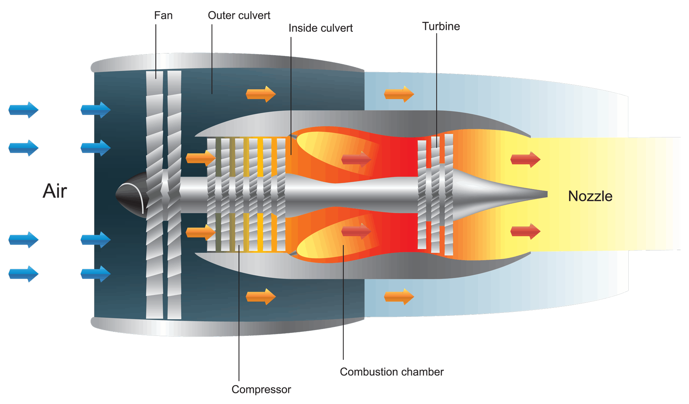
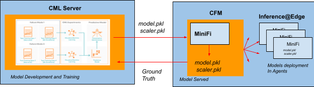

# **Predictive Maintenance at the Edge**
## **Motivations:**

Traditional computing architecture based predictive analytics engine relies on the model training and serving computations hosted on on-prem, cloud or hybrid infrastructure. The engine is invoked by a remote asset over a network with data on which the engine provides the inferences. This to and fro information exchange between the data generating asset and the predictive engine suffers from latency, potential dependence on network bandwidth and stability.

As connected devices proliferate in Industrial assets, there will be use cases of local computation on these devices driven by limited or intermittent network connectivity and need for real-time decision making. These devises at the edge may additionally have specific data processing challenges as driven by constraints in  power consumption, compute, memory and storage capabilities. 

Cloudera Edge Management (CEM) manages, controls, and monitors data collection and processing at the edge with a low code authorship experience addressing data management challenges with streaming and IoT use cases.
It provides two categories of capabilities:<br>
* **Edge Data Collection:** MiNiFi is a lightweight edge agent that implements the core features of Apache NiFi, focusing on data collection and processing at the edge. The MiNiFi agents come in two flavors: MiNiFi Java agents for full capabilities of Apache NiFi and MiNiFi C++ for very low footprint agents
* **Edge Flow Management:** Edge Flow Manager is an agent management hub that provides a low-code experience for designing, deploying, and monitoring edge flow applications on thousands of MiNiFi agents. It also acts as the single management and monitoring layer for all the MiNiFi agents deployed at the edge. EFM supports the entire edge flow lifecycle including authorship, deployment, and monitoring  

## **Use Case Description :** 
https://blog.cloudera.com/using-cml-to-build-a-predictive-maintenance-model-for-jet-engines/

This project uses simulation data sets from NASA that measures engine component degradation for turbofan jet engines. The models in this project are built on Cloudera Machine Learning Platform( CML) and are based on inputting various engine parameters showing typical sensor values of engine temperature, fuel consumption, vibration, or fuel to oxygen mixture (see Fig below). One item to note is that the term “failure” is not to imply catastrophic failure, but rather, that one of its components (pumps, values, etc) is not operating to specification. Airlines design their aircraft to operate at 99.999% reliability. 
Based on the provided independent variables, our objective is to predict  
- Remaining Useful Life ( RUL) measured in timecycles ( the specific unit of measurement of this timecycle is unknown )
- Propensity of failure (i.e. if the engine is likely to fail given a predefined training threshold of remaining useful life). If the predicted RUL is less than this threshold then we predict engine is likely to fail along with failure probability

Finally, the overall objective of this project is to show how Cloudera Data Platform enables the workflow pertaining to this use case. Therefore we will focus less on the machine learning techniques adopted.  



## **Conceptual Architecture**
<br>The machine learning workflow comprising of data ingestion, exploration, feature engineering and model training is performed in the CML Server. The best performing models are then transferred over network in this case to a Cloudera Flow Manager via REST API. The CFM then transfer the model to the agents at the Edge for inference Serving. ( Refer to the figure below)



## **Project Structure**
````
.EDGE2AI_PRED_MAINT
|-- data   # The datasets for model training ( for now we use FD001)
|-- jobs   # Will host the job in future to transfer the model to a remote CFM server for edge deployment 
|-- model  # The serialized models are  persisted in a .pkl file 
|-- src    # All the source code for the project including setup files
|-- images # image file for the architecture etc. 

Besides this you will find an archive folder, which can be ignored for this project. 
````
## **Dataset**
there are three types of  files in the dataset as can be seen in the data folder
- train_FDXXX.csv  
- test_FDXXX.csv
- RUL_FDXXX.txt

Each dataset code  eg. FD001 files should be analyzed at together for training, test and ground truth value(RUL). Per Kaggle Documentation each dataset comprises of a similar class of Jet Engines. There is very little known about the features in the dataset except that there are 2 Settings features, 14 Sensor features and some other features of unknown  type. The dependent variable(Y value) is in the column RUL (Remaining Useful Life) . For the training data this value is provided in the last column of the train_FDXXX file, while in test file we have only the features without the RUL, and for each engine the model prediction can be compared to this value to check model perforamance. 


## **Code**
````
.EDGE2AI_PRED_MAINT
|-- src
    |-- model_training.py            # Model training and comparison against baseline
    |-- Predictive Maintenance.ipynb # Notebook for Feature Exploration, model performance comparison
    |-- requirements.txt             # packages and versions
    |-- run_inference_test.py        # Checks predictions against sample data, to be deployed at Edge
    |-- serv_utils.py                # lightweight utility functions, to be deployed at Edge
    |-- train_utils.py               # utility functions for model training

````
## **Model**
This folder hosts the trained models. There is already are already pretrained models that are serialized in the file pred_RUL.pkl. When deserialized this will return a list containg the elements <br>
1. Scaler Object : This will be required to scale the test data 
2. Regression Model : Used for predicting RUL in time cycles
3. Classifier Model : Used for predicting failure ( i.e 1 it fails, 0 it will not fail ) and failure probabilities

## Steps for Setup ( To be expanded with Screen shots)
-  Launch a New CML Project 
-  Create a pull request for this project from github
-  Launch a new Project Session with default parameters
-  run the following command by launching Terminal to setup the necessary Python packages 
````
sh ./src/cdsw-build.sh
````
-  Walk through the Predictive Maintenance.ipynb for injestion, exploration, training and model persistence
-  Alternatively, you can just train the model directly by executing running hte file model_training.py
- Check whether the model has been persisted in model folder.
- Once the model is saved, you can check if the model is serving inferences for a sample record by executing the following command 
````
python3 ./src/run_inference_test.py "./model/pred_RUL.pkl"  "[1,4,0.0042,0.0000,100.0,518.67,642.44,1584.12,1406.42,14.62,21.61,554.07,2388.03,9045.29,1.30,47.28,521.38,2388.05,8132.90,8.3917,0.03,391,2388,100.00,39.00,23.3737]"
````
- You should see the response as below. The Response interpretation is the Remaining Useful Life (RUL) predicted is 118 Time cycles. The machine is not predicted to Fail. The probability of failure is 12%
`````
Test value of prediction : [118.58311]
[0] [[0.8794325  0.12056752]]
`````